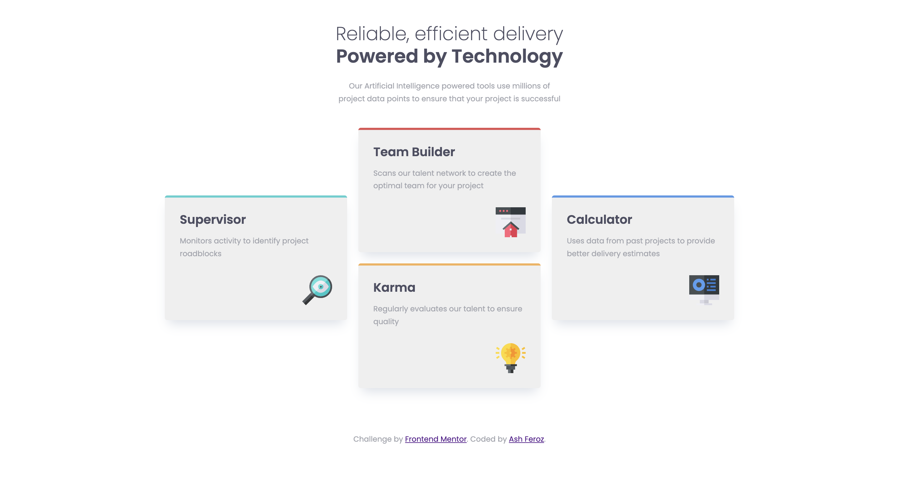

# Frontend Mentor - Four card feature section solution

This is a solution to the [Four card feature section challenge on Frontend Mentor](https://www.frontendmentor.io/challenges/four-card-feature-section-weK1eFYK). Frontend Mentor challenges help you improve your coding skills by building realistic projects. 

## Table of contents

- [Overview](#overview)
  - [The challenge](#the-challenge)
  - [Screenshot](#screenshot)
  - [Links](#links)
- [My process](#my-process)
  - [Built with](#built-with)
  - [What I learned](#what-i-learned)
  - [Continued development](#continued-development)
  - [Useful resources](#useful-resources)
- [Author](#author)
- [Acknowledgments](#acknowledgments)


## Overview

### The challenge

Users should be able to:

- View the optimal layout for the site depending on their device's screen size

### Screenshot

<div style="text-align: center;">


</div>

### Links

- Live Site URL: https://ashferoz.github.io/four-card-feature/

## My process

### Built with

- Semantic HTML5 markup
- CSS custom properties
- Flexbox
- CSS Grid
- Mobile-first workflow

### What I learned

First time using a double underscore (__) in CSS class naming.

I learned that this is a convention from BEM (Block-Element-Modifier) which makes your class naming convention more modular and reusable. This also keep things more organised!

One example I have used - my title is the child of the card.
```html
<h2 class="card__title">Supervisor</h2>
```

I also used grid for my layout - which was something I felt I needed to practice on more. I learned how to use grid-template-areas which essentially is letting the program know which areas you want your "card" to occupy.

For me, it helps to use "..." as empty spaces and align them into something I can visualise. For example, The code below I can visualise it as though it's like a tic-tac-toe layout.
```css
.layout-grid {
    grid-template-areas:
      "...  two  ..."
      "one  two  four"
      "one three four"
      "... three ...";
  }

  .layout-grid > :nth-child(1) {
    grid-area: one;
  }
```

Another thing I learned was to use variables in CSS! This makes the codes more scallable and also easier to tweak in the future. For example, if I were to change the accent color of my elements - I just need to change it in my variable and everything in my code will be altered.
```css
:root {
  --clr-teal: hsl(180, 58%, 56%);
  --clr-red: hsl(0, 70%, 60%);
  --clr-blue: hsl(212, 75%, 62%);
  --clr-yellow: hsl(34, 89%, 65%);
}
```

Declaring a variable does not always need to be in the root. For example in the code below, --gap variable can be used by the child of layout-grid. 
```css
.layout-grid {
  --gap: 1.5rem;
  display: grid;
  gap: var(--gap);
  grid-auto-columns: 1fr;
}
```

### Continued development

I would want to dive deeper and be more comfortable in using both flexbox and grid. Knowing when to use either of them would help as they each have their pros and cons. 

With CSS, the solutions are soooo broad hahah. There are no wrong methods if you are able to get the correct final result. Despite that, I would still love to be able to have a method that is both easy for others to pick up and is also scallable.

## Author

- Website - [Ash Feroz](https://ashferoz.netlify.app/main)

## Acknowledgments

[Kevin Powell - Responsive layout practice for beginners](https://youtu.be/JFbxl_VmIx0?si=poVa_nAe4NyoPP6B) - This helped me so much in terms of the little tricks I can use and also see the difference between using flexbox and grid. I followed his walkthrough and it really helped me understand the "WHYs".